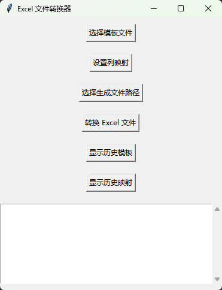
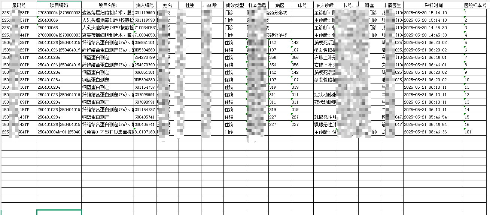
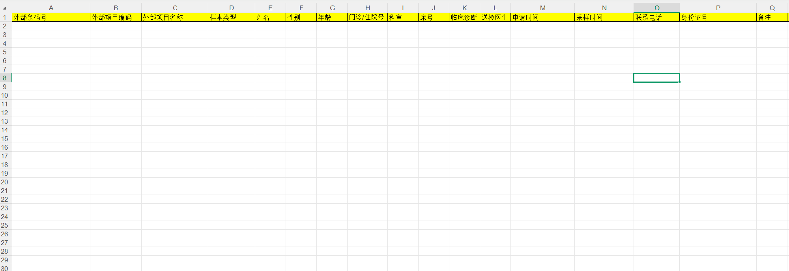
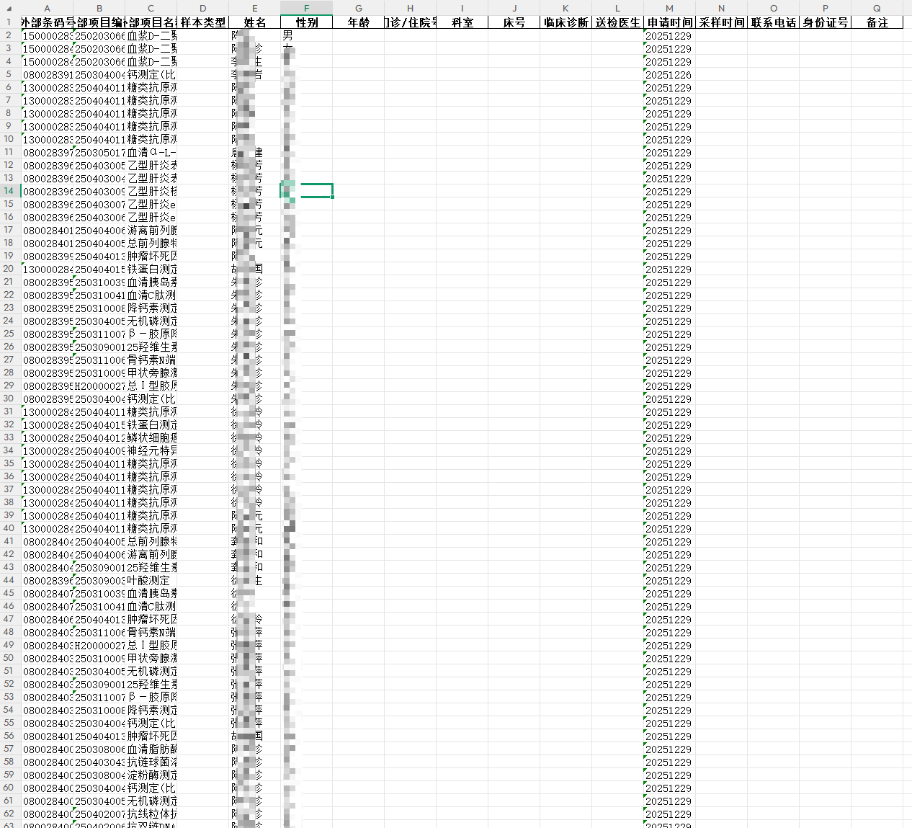

# Excel 转换器

一个基于 Python 的 Excel 文件批量转换工具，支持模板映射、列拆分、时间格式转换等功能。

## 功能特性

- **模板映射**：基于目标模板文件，将源 Excel 文件的列映射到模板格式
- **批量转换**：支持同时选择多个 Excel 文件进行转换
- **列拆分**：支持按分隔符拆分单元格内容为多行
- **时间格式转换**：支持自定义输入/输出时间格式（如 `yyyyMMdd` → `yyyy-MM-dd`）
- **历史记录**：自动保存模板和映射配置，方便复用
- **多工作表支持**：自动处理 Excel 文件中的所有工作表

## 安装

### 依赖

```bash
pip install pandas openpyxl xlrd
```

### 运行

```bash
python excel_converter.py
```

### 打包为可执行文件

```bash
pyinstaller -F -w --icon=icon/file-excel-fill.ico --name "Excel转换器" excel_converter.py
```

## 使用说明

1. **选择模板文件**：点击「选择模板文件」按钮，选择目标格式的 Excel 模板
2. **设置列映射**：点击「设置列映射」按钮，选择要转换的源文件，然后配置列对应关系
   - 可选：设置分隔符（用于拆分单元格）
   - 可选：设置时间格式转换规则
3. **选择保存目录**：点击「选择生成文件路径」按钮，指定输出目录
4. **转换文件**：点击「转换 Excel 文件」按钮，选择要批量转换的文件

### 时间格式说明

支持的时间格式示例：
- `yyyyMMdd` → 20250101
- `yyyy-MM-dd` → 2025-01-01
- `yyyy/MM/dd` → 2025/01/01
- `yyyy年MM月dd日` → 2025年01月01日
- `yyyy-MM-dd HH:mm:ss` → 2025-01-01 14:30:00

## 截图

### 程序界面



### 转换示例

**源文件（待转换）：**



**目标模板：**



**转换结果：**



## License

MIT License - 详见 [LICENSE](LICENSE) 文件
