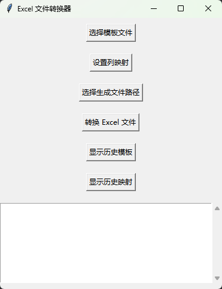
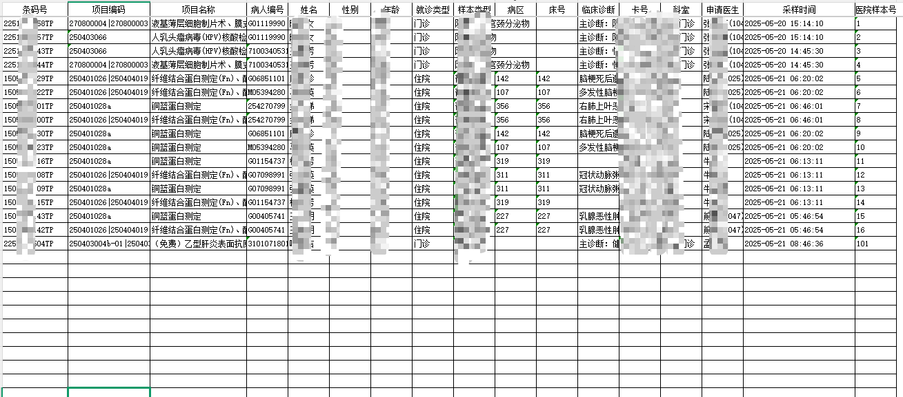
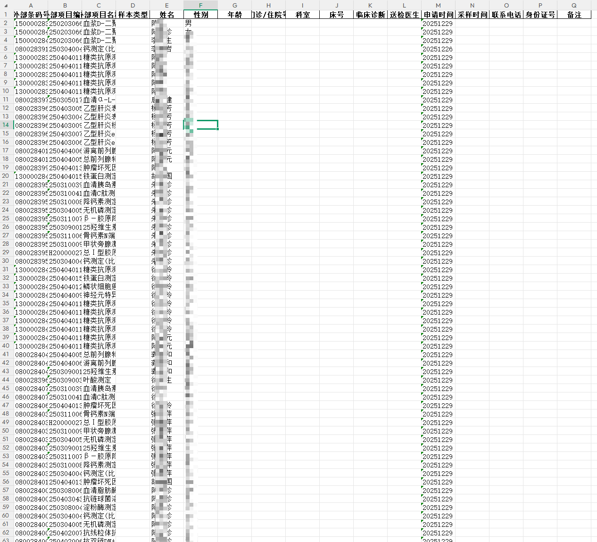

# Excel 转换器

一个基于 Python 的 Excel 文件批量转换工具，支持模板映射、列拆分、时间格式转换等功能。

## 功能特性

- **银行流水转换**：内置 12 家银行流水规则，一键转换至统一交易明细导入模板
- **模板映射**：基于目标模板文件，将源 Excel 文件的列映射到模板格式
- **批量转换**：支持同时选择多个 Excel 文件进行转换
- **列拆分**：支持按分隔符拆分单元格内容为多行
- **时间格式转换**：支持自定义输入/输出时间格式（如 `yyyyMMdd` → `yyyy-MM-dd`）
- **历史记录**：自动保存模板和映射配置，方便复用
- **多工作表支持**：自动处理 Excel 文件中的所有工作表

## 安装

### 依赖

```bash
pip install pandas openpyxl xlrd
```

### 运行

```bash
python excel_converter.py
```

### 打包为可执行文件

```bash
pyinstaller -F -w --icon=icon/file-excel-fill.ico --name "Excel转换器" --add-data "bank_rules.json;." excel_converter.py
```

> 注意：`--add-data "bank_rules.json;."` 用于把银行规则文件一并打包进 exe。Linux/macOS 下分隔符为 `:` 而非 `;`。

## 使用说明

### 一、银行流水转换（推荐）

适用于已支持的 12 家银行（招商、工商、农业、中国、交通、中信、民生、北京、上海、南京、宁波、农商、江西）。

1. 点击主界面顶部「银行流水转换」按钮
2. 在弹出窗口中选择银行类型、源文件、保存目录
3. 点击「开始转换」即可生成符合统一导入模板的文件（27 列严格格式）

**规则配置**：所有银行规则集中在 `bank_rules.json` 中，可根据银行模板调整。

### 二、通用模板映射（旧版）

适用于自定义模板和未内置规则的场景。

1. **选择模板文件**：点击「选择模板文件」按钮，选择目标格式的 Excel 模板
2. **设置列映射**：点击「设置列映射」按钮，选择要转换的源文件，然后配置列对应关系
   - 可选：设置分隔符（用于拆分单元格）
   - 可选：设置时间格式转换规则
3. **选择保存目录**：点击「选择生成文件路径」按钮，指定输出目录
4. **转换文件**：点击「转换 Excel 文件」按钮，选择要批量转换的文件

### 时间格式说明

支持的时间格式示例：
- `yyyyMMdd` → 20250101
- `yyyy-MM-dd` → 2025-01-01
- `yyyy/MM/dd` → 2025/01/01
- `yyyy年MM月dd日` → 2025年01月01日
- `yyyy-MM-dd HH:mm:ss` → 2025-01-01 14:30:00

## 截图

### 程序界面



### 转换示例

**源文件（待转换）：**



**目标模板：**


**转换结果：**



## License

MIT License - 详见 [LICENSE](LICENSE) 文件
